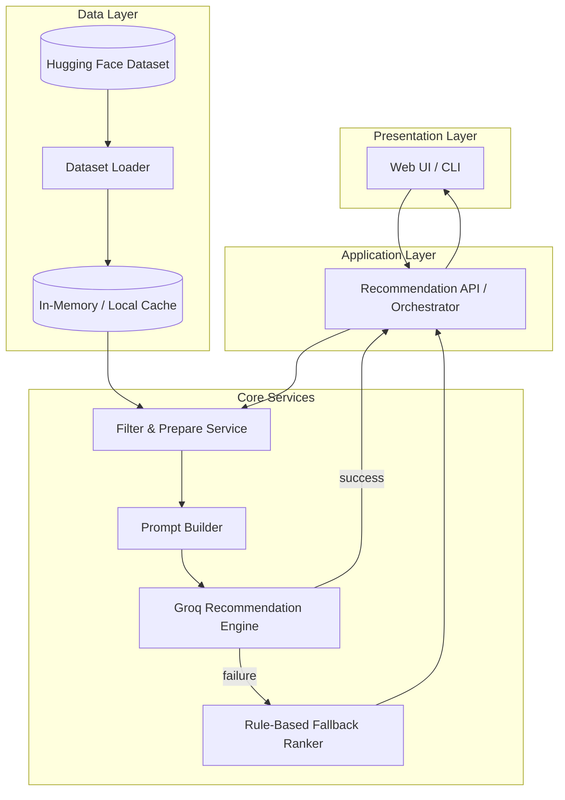
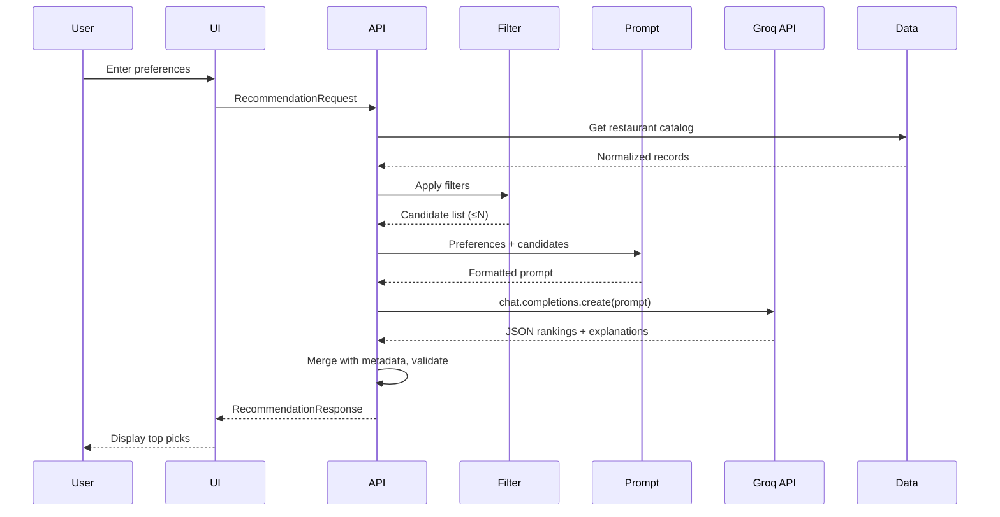
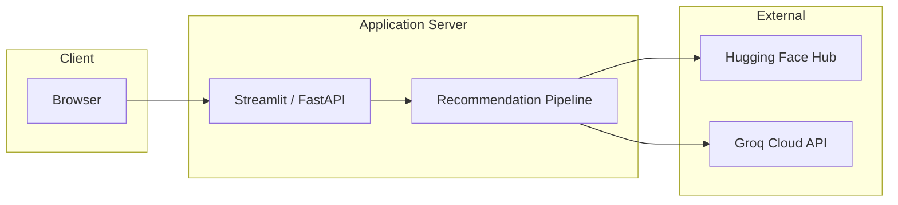

# Architecture: AI-Powered Restaurant Recommendation System

> Derived from [context.md](context.md) — Zomato-inspired recommendation service combining structured restaurant data with LLM reasoning.

---

## 1. Executive Summary

The system is a **preference-driven recommendation pipeline** that:

1. Ingests and normalizes restaurant data from Hugging Face
2. Accepts structured user preferences via a presentation layer
3. Filters candidates deterministically before LLM invocation
4. Uses **Groq** to rank, explain, and optionally summarize results
5. Returns a user-friendly list of top recommendations

The architecture separates **deterministic filtering** (fast, reproducible) from **probabilistic reasoning** (personalized explanations and ranking via Groq), keeping LLM calls bounded in cost and latency.

---

## 2. Design Principles

| Principle | Rationale |
|---|---|
| **Filter before LLM** | Reduce token usage by sending only relevant restaurants (typically top 20–50 after filters) |
| **Structured I/O** | User input and LLM output use validated schemas (Pydantic) to avoid parse failures |
| **Separation of concerns** | Data, business logic, LLM, and UI live in distinct modules |
| **Fail gracefully** | If Groq fails, fall back to rule-based ranking from filtered data |
| **Config-driven** | Groq API key, model name, budget thresholds, and top-K are environment/config variables |

---

## 3. High-Level Architecture



---

## 4. System Components

### 4.1 Presentation Layer

**Responsibility:** Collect user preferences and render recommendations.

| Option | Use case |
|---|---|
| **Streamlit** | Fastest path for milestone/demo; forms + result cards |
| **FastAPI + HTML/JS** | Lightweight REST + simple frontend |
| **FastAPI + React** | Production-style separation; more setup |

**User inputs (from context):**

- Location (city/area)
- Budget tier: `low` | `medium` | `high`
- Cuisine (single or multi-select)
- Minimum rating (float)
- Additional preferences (free text: e.g. "family-friendly", "quick service")

**Output display (from context):**

- Restaurant name
- Cuisine
- Rating
- Estimated cost
- AI-generated explanation

---

### 4.2 Application Layer (Orchestrator)

**Responsibility:** End-to-end request handling; coordinates data access, filtering, Groq API call, and response shaping.

**Primary flow:**

```
POST /recommend  →  validate input  →  filter restaurants  →  build prompt
                  →  call Groq  →  parse response  →  return RecommendationResponse
```

**Key behaviors:**

- Validates and normalizes user input (e.g. trim location, map budget enum)
- Enforces limits (max candidates sent to Groq, max recommendations returned)
- Handles timeouts and retries for Groq API calls
- Applies fallback ranking when Groq is unavailable

---

### 4.3 Data Ingestion Module

**Responsibility:** Load, preprocess, and expose the Zomato dataset.

**Source:** [ManikaSaini/zomato-restaurant-recommendation](https://huggingface.co/datasets/ManikaSaini/zomato-restaurant-recommendation) (~51K rows)

**Ingestion steps:**

1. **Load** — `datasets.load_dataset("ManikaSaini/zomato-restaurant-recommendation")`
2. **Extract** — Map raw columns to internal schema (see §6)
3. **Clean** — Handle nulls, normalize city names, parse cost strings, coerce ratings to float
4. **Index** — Build lookup structures for location and cuisine filters
5. **Cache** — Keep processed DataFrame in memory (or persist as Parquet for faster cold starts)

**Preprocessing rules (typical Zomato fields):**

| Raw field (expected) | Normalized field | Transform |
|---|---|---|
| `name` / `restaurant name` | `name` | Strip whitespace |
| `location` / `city` / `listed_in(city)` | `location` | Lowercase, alias map (e.g. "Bengaluru" → "bangalore") |
| `cuisines` | `cuisines` | Split on `,`, trim, lowercase |
| `rate` / `rating` | `rating` | Parse `"4.1/5"` → `4.1`; drop invalid |
| `approx_cost(for two people)` | `cost_for_two` | Parse `"₹800"` → `800` |
| `votes` | `votes` | Optional tie-breaker for ranking |

**Budget tier mapping (configurable):**

| Tier | Cost for two (INR) |
|---|---|
| `low` | ≤ 500 |
| `medium` | 501 – 1500 |
| `high` | > 1500 |

---

### 4.4 Filter & Prepare Service (Integration Layer)

**Responsibility:** Deterministic narrowing of the candidate set before LLM invocation.

**Filter pipeline (applied in order):**

1. **Location** — Match city/area (case-insensitive; optional fuzzy match)
2. **Cuisine** — Restaurant `cuisines` contains requested type
3. **Minimum rating** — `rating >= min_rating`
4. **Budget** — `cost_for_two` within tier range
5. **Additional preferences** — Keyword scan on name, `rest_type`, or `dish_liked` if available (optional pre-filter)

**Output to prompt builder:**

- Top N candidates (default N=30), sorted by rating and votes
- Compact JSON or markdown table for LLM context
- Metadata: total matches before truncation, applied filters

**Why filter first:**

- Keeps prompts small and within context limits
- Grounds LLM in real dataset rows (reduces hallucination)
- Makes latency predictable

---

### 4.5 Prompt Builder

**Responsibility:** Construct a structured prompt that instructs Groq to reason over **only** the provided restaurants.

**Prompt structure:**

1. **System role** — Expert dining recommender; must only recommend from supplied list
2. **User preferences** — Serialized `UserPreferences` object
3. **Candidate restaurants** — Structured list with id, name, cuisine, rating, cost
4. **Task instructions** — Rank top K (e.g. 5), explain each choice, optional summary paragraph
5. **Output format** — JSON schema for machine parsing

**Example output schema (Groq must return):**

```json
{
  "summary": "Brief overview of recommendations for the user's preferences.",
  "recommendations": [
    {
      "restaurant_id": "123",
      "rank": 1,
      "explanation": "Why this restaurant fits location, budget, cuisine, and extra preferences."
    }
  ]
}
```

**Prompt design guidelines:**

- Explicitly forbid inventing restaurants not in the candidate list
- Ask for explanations tied to **specific** user inputs
- Request JSON-only output for reliable parsing
- Include few-shot example if model drifts from format

---

### 4.6 Groq Recommendation Engine

**Responsibility:** Call the Groq API, parse structured response, merge with restaurant metadata.

**Provider:** [Groq](https://groq.com/) — fast inference API for open-source models via the official `groq` Python SDK.

**Default model (configurable):**

| Model | Use case |
|---|---|
| `llama-3.3-70b-versatile` | Default — strong reasoning for ranking and explanations |
| `llama-3.1-8b-instant` | Lower latency / dev testing |
| `mixtral-8x7b-32768` | Alternative with large context window |

**Configuration (`.env`):**

```env
GROQ_API_KEY=your_groq_api_key
GROQ_MODEL=llama-3.3-70b-versatile
```

**Integration pattern (`services/llm_engine.py`):**

```python
from groq import Groq

client = Groq(api_key=settings.groq_api_key)

response = client.chat.completions.create(
    model=settings.groq_model,
    messages=[
        {"role": "system", "content": system_prompt},
        {"role": "user", "content": user_prompt},
    ],
    temperature=0.3,
    response_format={"type": "json_object"},  # when supported by model
)
```

**Engine operations:**

| Operation | Description |
|---|---|
| `rank()` | Order candidates by Groq-assigned rank |
| `explain()` | Attach per-restaurant explanation strings |
| `summarize()` | Optional overall summary of choices |

**Post-processing:**

- Join Groq `restaurant_id` / name back to full records (cuisine, rating, cost)
- Validate all returned IDs exist in candidate set; drop or flag invalid entries
- If fewer than K valid results, pad from rule-based ranker

**Fallback ranker (no Groq):**

- Sort filtered list by: rating (desc) → votes (desc) → cost proximity to budget tier midpoint
- Generate template explanations: *"Rated 4.5 with Italian cuisine in Indiranagar, within your medium budget."*

---

## 5. Data Flow (End-to-End)



---

## 6. Domain Models

### 6.1 UserPreferences

```python
class UserPreferences(BaseModel):
    location: str
    budget: Literal["low", "medium", "high"]
    cuisine: str | list[str]
    min_rating: float = Field(ge=0, le=5)
    additional_preferences: str | None = None
```

### 6.2 Restaurant (internal)

```python
class Restaurant(BaseModel):
    id: str
    name: str
    location: str
    cuisines: list[str]
    rating: float
    cost_for_two: int
    votes: int | None = None
    raw: dict | None = None  # optional original row
```

### 6.3 Recommendation (API response)

```python
class Recommendation(BaseModel):
    rank: int
    name: str
    cuisine: str           # display string, e.g. "Italian, Pizza"
    rating: float
    estimated_cost: str    # e.g. "₹800 for two"
    explanation: str

class RecommendationResponse(BaseModel):
    summary: str | None
    recommendations: list[Recommendation]
    total_matches: int
    filters_applied: dict
```

---

## 7. Proposed Project Structure

```
Zomato-Milestone1/
├── Docs/
│   └── Problemstatement.txt
├── context.md
├── architecture.md
├── README.md
├── requirements.txt
├── .env.example                 # GROQ_API_KEY, GROQ_MODEL, app config
├── config/
│   └── settings.py              # Budget tiers, top-K, GROQ_MODEL, dataset name
├── src/
│   ├── __init__.py
│   ├── main.py                  # App entry (Streamlit or FastAPI)
│   ├── data/
│   │   ├── loader.py            # Hugging Face load + cache
│   │   ├── preprocessor.py      # Clean & normalize
│   │   └── repository.py        # Query interface over DataFrame
│   ├── models/
│   │   ├── preferences.py
│   │   ├── restaurant.py
│   │   └── recommendation.py
│   ├── services/
│   │   ├── filter_service.py    # Integration layer filters
│   │   ├── prompt_builder.py
│   │   ├── llm_engine.py        # Groq client wrapper
│   │   └── fallback_ranker.py
│   ├── api/
│   │   ├── routes.py            # If using FastAPI
│   │   └── orchestrator.py      # Pipeline coordinator
│   └── ui/
│       └── app.py               # Streamlit UI components
├── prompts/
│   └── recommendation.txt       # Prompt template
└── tests/
    ├── test_filter_service.py
    ├── test_preprocessor.py
    └── test_orchestrator.py
```

---

## 8. API Contract (if using REST)

### `POST /recommend`

**Request:**

```json
{
  "location": "indiranagar",
  "budget": "medium",
  "cuisine": "Italian",
  "min_rating": 4.0,
  "additional_preferences": "family-friendly, outdoor seating"
}
```

**Response:**

```json
{
  "summary": "These Italian spots in Indiranagar balance strong ratings with mid-range pricing.",
  "recommendations": [
    {
      "rank": 1,
      "name": "Example Trattoria",
      "cuisine": "Italian, Pizza",
      "rating": 4.5,
      "estimated_cost": "₹900 for two",
      "explanation": "Highly rated Italian restaurant in Indiranagar within your medium budget, suitable for families."
    }
  ],
  "total_matches": 42,
  "filters_applied": {
    "location": "indiranagar",
    "budget": "medium",
    "cuisine": "italian",
    "min_rating": 4.0
  }
}
```

### `GET /health`

Returns service status and dataset load state.

---

## 9. Technology Stack (Recommended)

| Layer | Technology | Notes |
|---|---|---|
| Language | Python 3.10+ | Ecosystem for ML/data/LLM |
| Dataset | `datasets` (Hugging Face) | Load `ManikaSaini/zomato-restaurant-recommendation` |
| Data processing | `pandas` | Filtering, normalization |
| Validation | `pydantic` | Request/response models |
| LLM | `groq` (Groq Python SDK) | GroqCloud API; model via `GROQ_MODEL` env var |
| API | `fastapi` + `uvicorn` | Optional; Streamlit can call services directly |
| UI | `streamlit` | Rapid demo aligned with milestone scope |
| Config | `python-dotenv` | Secrets and model selection |
| Testing | `pytest` | Unit tests for filter and preprocess |

---

## 10. Cross-Cutting Concerns

### 10.1 Error Handling

| Scenario | Behavior |
|---|---|
| Dataset load failure | Fail startup with clear message; document HF access |
| Zero filter matches | Return empty list + suggestion to relax filters |
| Groq timeout / rate limit / error | Use fallback ranker; flag `llm_used: false` in response |
| Invalid Groq JSON response | Retry once with repair prompt; else fallback |
| Hallucinated restaurant | Strip entries not in candidate set |

### 10.2 Security

- Store `GROQ_API_KEY` in `.env`; never commit secrets
- Sanitize free-text `additional_preferences` before prompt injection
- Rate-limit public API if deployed

### 10.3 Performance

- One-time dataset load at startup (~574 MB — allow warm-up time)
- Cap candidates sent to Groq (20–30 rows)
- Groq offers low-latency inference — still batch candidates to control token cost
- Optional Parquet cache after first preprocess

### 10.4 Observability

- Log filter counts, Groq latency, and token usage from response metadata
- Optional: log prompts/responses in dev only (redact in prod)

---

## 11. Deployment View



**Milestone deployment options:**

- **Local:** `streamlit run src/ui/app.py` with `.env` containing `GROQ_API_KEY`
- **Cloud (optional):** Streamlit Cloud, Railway, or Render with `GROQ_API_KEY` and `GROQ_MODEL` env vars

---

## 12. Mapping to Context Workflow

| Context step | Architecture component |
|---|---|
| 1. Data Ingestion | `data/loader.py`, `data/preprocessor.py`, `data/repository.py` |
| 2. User Input | `ui/app.py` or API request body → `UserPreferences` |
| 3. Integration Layer | `services/filter_service.py`, `services/prompt_builder.py` |
| 4. Recommendation Engine | `services/llm_engine.py` (Groq), `services/fallback_ranker.py` |
| 5. Output Display | UI cards / API `RecommendationResponse` |

---

## 13. Future Extensions (Out of Scope for Milestone 1)

- Vector search over reviews/descriptions for semantic matching
- User accounts and saved preferences
- Geolocation-based distance filtering
- A/B testing Groq prompts and models
- Caching recommendations by preference hash
- Batch offline evaluation against held-out preferences

---

## 14. Success Criteria

The architecture is satisfied when:

1. User can submit all preference types defined in [context.md](context.md)
2. Recommendations are grounded in the Hugging Face Zomato dataset
3. Each result includes name, cuisine, rating, cost, and AI explanation
4. System degrades gracefully if Groq is unavailable
5. Code structure matches the layered design above and is testable in isolation
