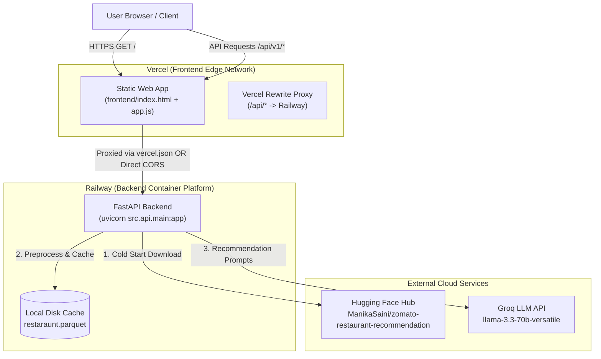

# Production Deployment Plan: Railway (Backend) & Vercel (Frontend)

This document outlines the architecture, step-by-step deployment instructions, configuration templates, and verification checklist for deploying the **CraveAI / Zomato AI Restaurant Recommendation Application** across **Railway** (FastAPI Backend) and **Vercel** (Static Web Frontend).

---

## 1. Executive Summary & Architecture Overview

The application follows a **decoupled deployment architecture**, running the FastAPI backend service and static frontend on specialized cloud platforms optimized for each workload:



### Why Decoupled Deployment?
- **Railway (Backend)**: Provides continuous Python runtime containers with dynamic `$PORT` assignment, disk storage for dataset parquet caching (`restaraunt.parquet`), and long-running HTTP request handling required for LLM inference.
- **Vercel (Frontend)**: Provides global CDN edge distribution for static assets (`index.html`, `app.js`, styles) with zero-config HTTPS and edge proxying capabilities.

---

## 2. Backend Deployment on Railway

### 2.1 Prerequisites & System Requirements
- A [Railway Account](https://railway.app/).
- Your GitHub repository connected to Railway.
- A valid **Groq API Key** (`GROQ_API_KEY`) from [Groq Console](https://console.groq.com/).

### 2.2 Required Environment Variables (Railway Dashboard)
Configure the following environment variables under your Railway service's **Variables** tab:

| Variable Name | Required Value / Example | Description |
| :--- | :--- | :--- |
| `GROQ_API_KEY` | `gsk_...` | **Required.** API key to authenticate with Groq LLM API. |
| `GROQ_MODEL` | `llama-3.3-70b-versatile` | Groq LLM model identifier. |
| `DATASET_NAME` | `ManikaSaini/zomato-restaurant-recommendation` | Hugging Face dataset identifier. |
| `MAX_CANDIDATES` | `30` | Number of filtered candidates passed to the LLM engine. |
| `TOP_K_RECOMMENDATIONS` | `5` | Number of final recommendations returned to the client. |
| `APP_TITLE` | `AI Restaurant Recommender` | Title of the FastAPI application. |
| `PYTHONUNBUFFERED` | `1` | Ensures immediate stdout/stderr logging in Railway logs. |

> [!NOTE]
> Railway automatically sets and injects the `$PORT` environment variable. You do **not** need to manually define `PORT`.

---

### 2.3 Step-by-Step Railway Deployment Guide

1. **Create a New Project on Railway**:
   - Go to the [Railway Dashboard](https://railway.app/dashboard) and click **New Project** -> **Deploy from GitHub repo**.
   - Select your Zomato AI Recommendation repository.

2. **Configure Build & Start Command**:
   - Railway uses **Nixpacks** to automatically detect `requirements.txt` and install Python dependencies (`FastAPI`, `Uvicorn`, `Pandas`, `Datasets`, `Groq`, etc.).
   - In the Railway Service settings -> **Deploy** -> **Custom Start Command**, enter:
     ```bash
     uvicorn src.api.main:app --host 0.0.0.0 --port $PORT
     ```
   - *Alternatively, you can add a `Procfile` at the root of your project (see Section 4.1).*

3. **Generate Public Domain**:
   - Under your Railway Service -> **Settings** -> **Networking**, click **Generate Domain** (e.g., `zomato-ai-backend-production.up.railway.app`).
   - Copy this URL—you will need it when configuring Vercel.

4. **Understand Cold Start & Dataset Caching Behavior**:
   - Because `*.parquet` is ignored in `.gitignore`, the first time your Railway container boots, `src/data/loader.py` will automatically download `ManikaSaini/zomato-restaurant-recommendation` from Hugging Face (~149 MB), preprocess it, and cache `restaraunt.parquet` on the container's disk.
   - Initial container startup may take **20–40 seconds** during the first download. Subsequent requests use the local parquet file in memory.

5. **Verify Backend Health**:
   - Visit `https://<your-railway-domain>/api/v1/health` in your browser.
   - Expected JSON response:
     ```json
     {
       "status": "healthy",
       "version": "1.0.0",
       "dataset_loaded": true,
       "total_restaurants": 55000
     }
     ```
   - Interactive API docs are available at `https://<your-railway-domain>/docs`.

---

## 3. Frontend Deployment on Vercel

### 3.1 Architecture for API Communication
Your static frontend (`frontend/app.js`) currently sends requests to `/api/v1/metadata` and `/api/v1/recommend`.

When hosting the frontend on Vercel separately from the Railway backend, you can choose between two clean approaches:

#### Approach A: Vercel Rewrite Proxy (Recommended — Zero Code Change)
By placing a `vercel.json` file in your repository root, Vercel will serve your static frontend from the `frontend/` directory while seamlessly proxying all `/api/*` requests directly to your Railway backend over the Edge CDN.

#### Approach B: Direct CORS Configuration
Configure an explicit `API_BASE_URL` in `frontend/app.js` pointing directly to your Railway domain (`https://<your-railway-app>.up.railway.app`). Since `src/api/main.py` already includes `CORSMiddleware` with `allow_origins=["*"]`, browser cross-origin requests work natively.

---

### 3.2 Step-by-Step Vercel Deployment Guide

1. **Import Project to Vercel**:
   - Log in to [Vercel](https://vercel.com/dashboard) -> click **Add New** -> **Project** -> Import your GitHub repository.

2. **Configure Project Settings**:
   - **Framework Preset**: `Other`
   - **Root Directory**: Leave as root (`./`) if using `vercel.json` (recommended), OR set to `frontend` if deploying purely static files with Approach B.
   - **Build Command**: Leave empty (no build step needed for vanilla HTML/JS/CSS).
   - **Output Directory**: Leave default (`frontend` specified via `vercel.json`).

3. **Set Environment Variables on Vercel (If using Vercel Proxy / Rewrites)**:
   - Add a Vercel environment variable or replace the backend URL in `vercel.json`:
     - Key: `BACKEND_URL`
     - Value: `https://<your-railway-domain>.up.railway.app`

4. **Deploy & Inspect**:
   - Click **Deploy**. Vercel will assign a production URL (e.g., `https://zomato-ai-frontend.vercel.app`).

---

## 4. Configuration Templates

### 4.1 `Procfile` (Railway Root Directory - Optional)
Create a file named `Procfile` in the project root to explicitly define the web worker process:

```procfile
web: uvicorn src.api.main:app --host 0.0.0.0 --port $PORT
```

---

### 4.2 `vercel.json` (Vercel Root Directory - Recommended Approach A)
Create a file named `vercel.json` in your project root. Replace `YOUR_RAILWAY_APP_URL` with your actual Railway domain:

```json
{
  "outputDirectory": "frontend",
  "rewrites": [
    {
      "source": "/api/:path*",
      "destination": "https://YOUR_RAILWAY_APP_URL/api/:path*"
    },
    {
      "source": "/docs",
      "destination": "https://YOUR_RAILWAY_APP_URL/docs"
    },
    {
      "source": "/openapi.json",
      "destination": "https://YOUR_RAILWAY_APP_URL/openapi.json"
    }
  ]
}
```

---

### 4.3 Alternative: Frontend API Base URL Support (`frontend/app.js` - Approach B)
If you prefer not to use Vercel rewrites, you can make `app.js` automatically detect or use an API base URL:

```javascript
// Add at top of frontend/app.js
const API_BASE_URL = window.API_BASE_URL || "https://YOUR_RAILWAY_APP_URL";

// Update fetch calls:
const response = await fetch(`${API_BASE_URL}/api/v1/metadata`);
const res = await fetch(`${API_BASE_URL}/api/v1/recommend`, { ... });
```

---

## 5. End-to-End Verification & Checklist

### 5.1 Pre-Flight Deployment Checklist
- [ ] **Groq API Key**: Confirmed valid and set in Railway `GROQ_API_KEY`.
- [ ] **Start Command**: Railway configured to run `uvicorn src.api.main:app --host 0.0.0.0 --port $PORT`.
- [ ] **CORS Settings**: `src/api/main.py` has `CORSMiddleware` configured (already enabled by default).
- [ ] **Parquet Ignore**: Confirmed `*.parquet` is in `.gitignore` so Railway performs a clean build.
- [ ] **Vercel Rewrite Destination**: `vercel.json` points to the generated `https://*.up.railway.app` domain.

### 5.2 Verification Testing Steps

1. **Verify Backend Health Endpoint**:
   ```bash
   curl -i https://<your-railway-domain>.up.railway.app/api/v1/health
   ```
   Must return HTTP `200 OK` with `"status": "healthy"` and `"dataset_loaded": true`.

2. **Verify Frontend Static Serving**:
   - Open your Vercel URL (`https://<your-vercel-domain>.vercel.app`) in browser.
   - Check developer console (`F12` -> Network tab) to verify `index.html` and `app.js` load with HTTP `200 OK`.

3. **Verify Metadata Hydration**:
   - When the page loads, inspect the network call to `/api/v1/metadata`.
   - Ensure the Location dropdown is populated with localities (`indiranagar`, `koramangala 5th block`, etc.).

4. **Verify End-to-End AI Recommendation Flow**:
   - Select Location: **Indiranagar**
   - Select Budget: **Medium (₹500 - ₹1500)**
   - Select Cuisine: **Italian**
   - Click **Find CraveAI Recommendations**.
   - Verify that results are rendered with recommendation cards, AI rationale badges, and rating scores.

---

## 6. Troubleshooting Guide

| Symptom | Probable Cause | Resolution |
| :--- | :--- | :--- |
| **Railway Container Crash on Startup (`OOM` or Timeout)** | Downloading/preprocessing ~149 MB Hugging Face dataset exceeded initial memory/timeout during first boot. | Check Railway logs. Ensure service has at least 1GB RAM allocated. Subsequent restarts will be fast once cached. |
| **Frontend shows `404 Not Found` on API requests (`/api/v1/metadata`)** | Vercel rewrite proxy (`vercel.json`) is missing or pointing to placeholder domain. | Verify `vercel.json` contains your live Railway domain (`https://...up.railway.app/api/:path*`) and redeploy Vercel. |
| **CORS Error in Browser Console** | Making direct cross-origin calls without proxy and custom origins blocked. | Verify `CORSMiddleware` in `src/api/main.py` uses `allow_origins=["*"]` or use the `vercel.json` rewrite approach. |
| **Recommendations Return HTTP `500 Internal Server Error`** | Invalid or missing `GROQ_API_KEY` on Railway. | Check Railway application logs for Groq API authentication error. Verify API key in Railway Variables tab. |
